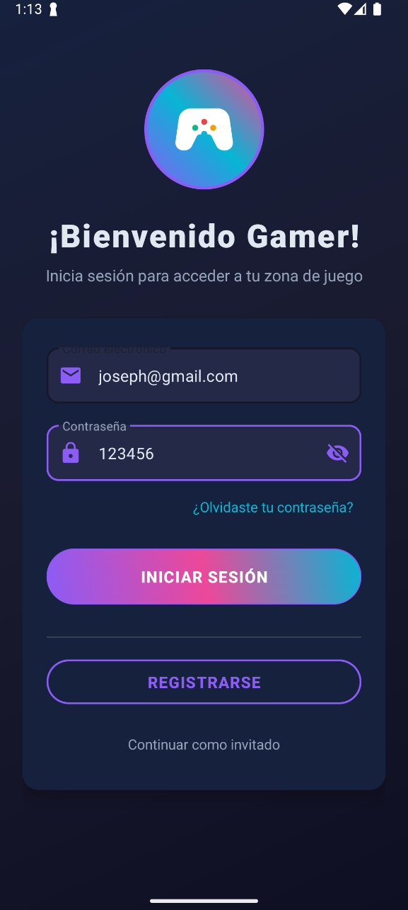
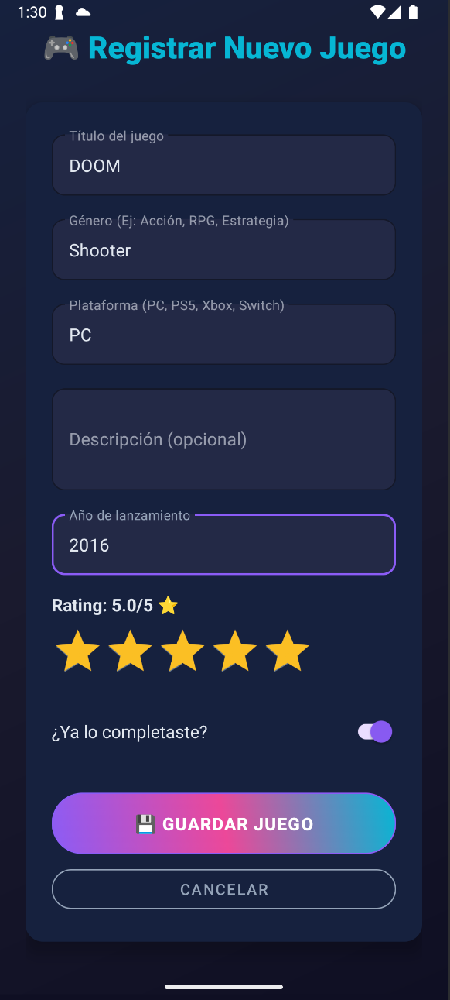
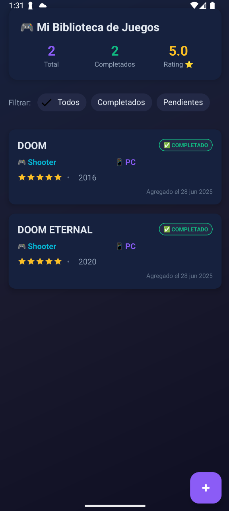
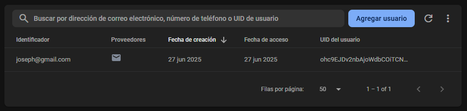
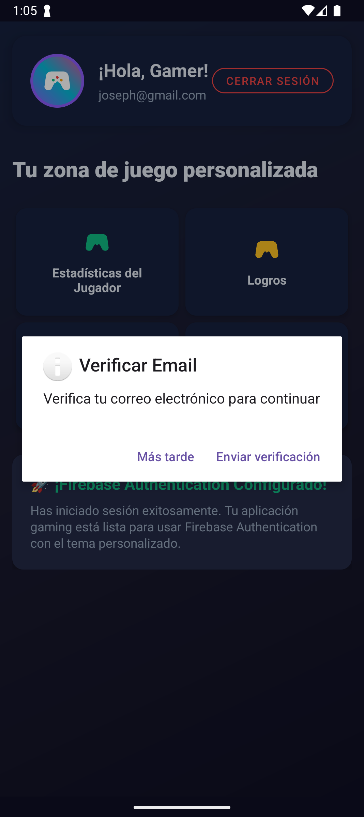
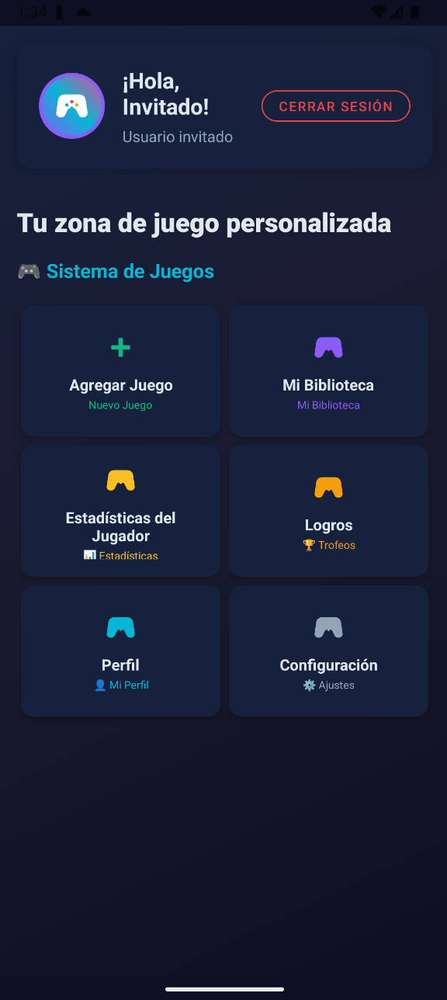

# 📱 App S10 - Authentication y Realtime Database

## 📖 Descripción

**GameVault** es una aplicación móvil desarrollada en Android que implementa un **sistema completo de gestión de bibliotecas gaming** utilizando **Firebase Authentication** y **Firebase Realtime Database**. La aplicación presenta un **tema gaming moderno** con colores neón y diseño Material Design optimizado para gamers.

## 🎯 Objetivos - Sistema Gaming

- **Autenticación Firebase:** Login/Registro con email y contraseña
- **Biblioteca Personal:** Sistema de registro y gestión de juegos
- **Base de Datos Tiempo Real:** Sincronización automática con Firebase

---

## ✨ Características Principales

### 🔐 Sistema de Autenticación
- ✅ **Login/Registro** con email y contraseña
- 🔄 **Login anónimo** (modo invitado)
- 📧 **Recuperación de contraseña**
- ✅ **Verificación de email**
- 🛡️ **Validaciones** y manejo de errores
- 🚪 **Logout seguro**

### 🎮 Registro de Juegos
- 📝 **Formulario completo** con título, género, plataforma, año, rating
- ⭐ **Sistema de calificación** de 1-5 estrellas
- ✅ **Estado completado** para marcar juegos terminados
- 💾 **Persistencia** en Firebase Realtime Database
- 🔄 **Sincronización** en tiempo real

### 📚 Biblioteca Gaming
- 📋 **Lista completa** de juegos registrados
- 🔍 **Filtros dinámicos:** todos, completados, pendientes
- 📊 **Estadísticas automáticas:** total, completados, rating promedio
- 🗑️ **Eliminación** con confirmación
- 🎨 **Tema gaming** con colores neón

---

## 📸 Capturas de Pantalla

### Pantalla Principal


*Dashboard principal con acceso a todas las funcionalidades gaming*

### Autenticación


*Interfaz de login con tema gaming y validaciones*

### Registro de Usuario


*Formulario completo para registrar nuevos juegos*

### Biblioteca Personal


*Lista de juegos con estadísticas y filtros dinámicos*

### Base de Datos en Tiempo Real (Realtime Database)


*Sincronización automática con Firebase Realtime Database*

### Sistema de Autenticación (Firebase Authentication)


*Firebase Authentication configurado y funcionando*

### Verificación de Email


*Sistema de verificación de correo electrónico*

### Usuario Invitado


*Dashboard para usuarios en modo invitado (login anónimo)*

---

## 📋 Cumplimiento de Requisitos

### ✅ 1. Firebase Authentication
- [x] **Login con email y contraseña**
- [x] **Registro de nuevos usuarios**
- [x] **Login anónimo (modo invitado)**
- [x] **Recuperación y verificación de email**

```kotlin
// Implementación de login
auth.signInWithEmailAndPassword(email, password)
    .addOnCompleteListener { task ->
        if (task.isSuccessful) {
            navigateToMainActivity()
        } else {
            handleAuthError(task.exception)
        }
    }
```

### ✅ 2. Sistema de Registro de Juegos
- [x] **Campos:** título, género, plataforma, año, rating, descripción
- [x] **Validaciones** robustas de entrada
- [x] **Guardado** en Firebase Realtime Database
- [x] **IDs únicos** generados automáticamente

```kotlin
// Guardar juego en Firebase
val game = Game(
    id = gameId,
    title = title,
    genre = genre,
    platform = platform,
    rating = rating,
    completed = completed,
    userId = userId,
    createdAt = System.currentTimeMillis()
)

database.child("games").child(userId).child(gameId).setValue(game)
```

### ✅ 3. Biblioteca Personal con Filtros
- [x] **Lista en tiempo real** con ValueEventListener
- [x] **Filtros:** todos, completados, pendientes
- [x] **Estadísticas** automáticas
- [x] **Eliminación** con confirmación
- [x] **Datos privados** por usuario autenticado

```kotlin
// Cargar juegos en tiempo real
database.child("games").child(userId)
    .addValueEventListener(object : ValueEventListener {
        override fun onDataChange(snapshot: DataSnapshot) {
            updateGamesList(snapshot)
            updateStatistics()
        }
    })
```

---

## 🔧 Tecnologías y Componentes Utilizados

### 🔥 Firebase Services
- **Firebase Authentication** - Gestión de usuarios
- **Firebase Realtime Database** - Base de datos en tiempo real
- **Google Services** - SHA keys configurados

### 🎨 Material Design
- **CardView** - Tarjetas con tema gaming
- **TextInputLayout** - Campos con validaciones
- **RecyclerView** - Lista eficiente de juegos
- **MaterialButton** - Botones con gradientes
- **Switch** - Control de estados

### 📱 Componentes Android
- **Activities** - MainActivity, LoginActivity, AddGameActivity, GamesListActivity
- **Adapters** - GameAdapter para RecyclerView
- **Data Classes** - Game model para Firebase
- **SharedPreferences** - Configuraciones locales

---

## 🚀 Cómo Probar

### 🔐 Autenticación
1. Abrir app → Pantalla de login
2. Registrar usuario: "joseph@uns.edu.pe", "123456"
3. Login exitoso → Dashboard principal
4. Probar login anónimo → Funciona sin registro

### 🎮 Registro de Juegos
1. Dashboard → "Agregar Juego"
2. Llenar: "The Legend of Zelda", "Aventura", "Nintendo Switch", "2017", Rating 5⭐
3. Marcar como completado → Guardar
4. Verificar en Firebase Console que aparezca

### 📚 Biblioteca Personal
1. Dashboard → "Mi Biblioteca"
2. Ver juego agregado con estadísticas
3. Filtrar por "Completados" → Aparece el juego
4. Eliminar juego → Confirmación requerida

---

## 👨‍💻 Autor

**Dueñas Blas, Joseph**
- 🎓 Universidad Nacional del Santa